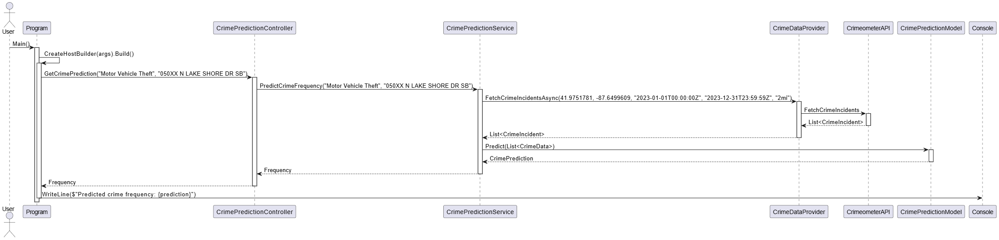

# CrimePredictionApp

CrimePredictionApp is a basic .NET application that predicts crime frequency based on crime type and location. It uses ASP.NET Core for the API and ML.NET for machine learning predictions.

## Prerequisites

- .NET 9.0
- Visual Studio 2022 (or another compatible IDE)
- API Key for Crimeometer (to be configured in `CrimeDataProvider`)

## Installation

1. Clone the repository:
2. Open the project in Visual Studio.
3. Install the necessary NuGet packages:
   - Microsoft.Extensions.Hosting
   - Microsoft.Extensions.DependencyInjection
   - Microsoft.ML
   - xUnit
   - Moq
   - FluentAssertions

   You can install these packages via the NuGet Package Manager Console
   
## Configuration
1. Configure your Crimeometer API key in `CrimeDataProvider`:
   
## Usage
1. Run the application
2. The application will predict the crime frequency for a given crime type and location and display the result in the console.

## Project Structure

- `Controllers/CrimePredictionController.cs`: API controller for crime predictions.
- `Services/CrimePredictionService.cs`: Service to handle crime prediction logic.
- `ML/CrimePredictionModel.cs`: Machine learning model to predict crime frequency.
- `Data/CrimeDataProvider.cs`: Data provider to fetch crime incidents.
- `Models/`: Contains data models used in the application.
- `Program.cs`: Main entry point of the application.

## Crimeometer API

This application uses the [Crimeometer API](https://www.crimeometer.com/#comp-ioifcuui) to fetch crime incident data. Crimeometer provides detailed crime data for various locations, which is used to train and make predictions in this application.

To use the Crimeometer API, you need to sign up for an API key on their website. Once you have the API key, configure it in the `CrimeDataProvider` class as shown in the Configuration section.

## Sequence Diagram

The following sequence diagram illustrates the flow of a request from the user to the prediction result being displayed in the console, including the call to the Crimeometer API to fetch crime incident data:

## Tests

Unit tests are written using `xUnit`, `Moq`, and `FluentAssertions`.
To run the tests, use the following command

## Contributing
Contributions are welcome! Please submit a pull request or open an issue to discuss the changes you would like to make.

## License
This project is licensed under the MIT License. 

      
